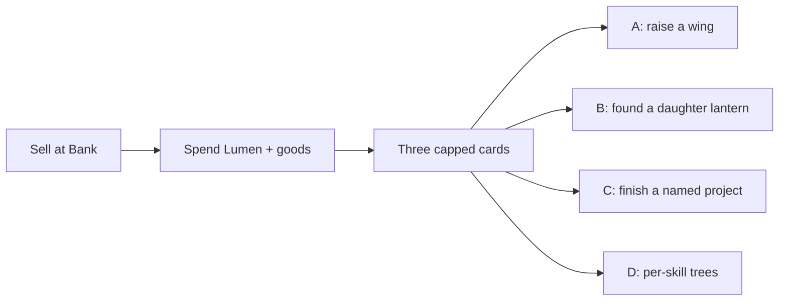
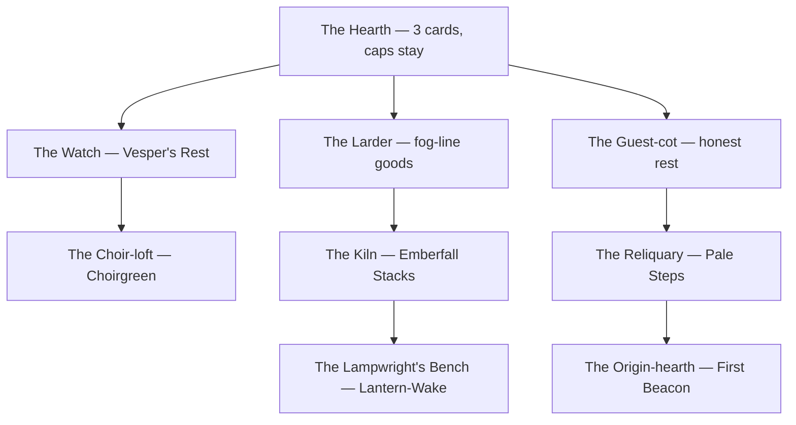
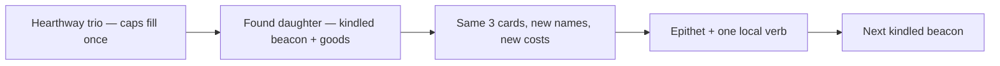
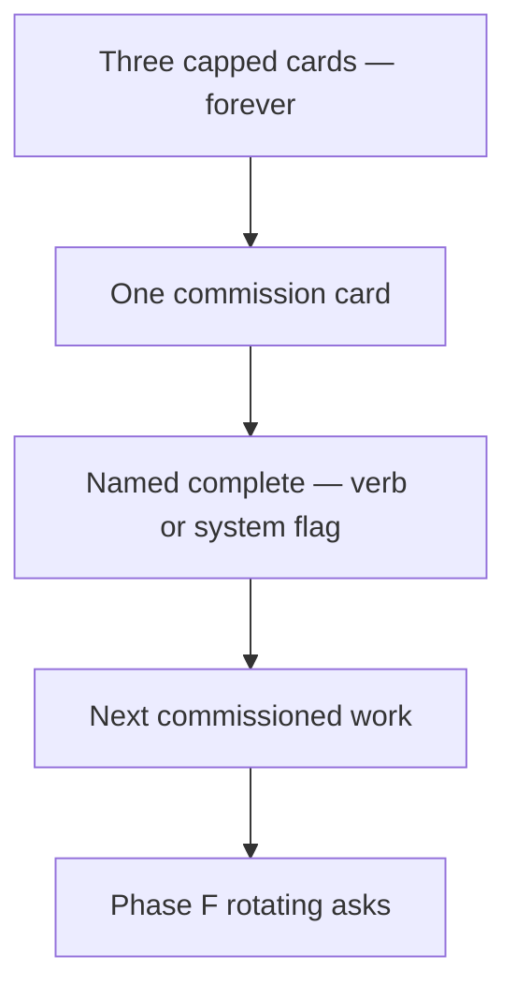
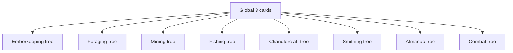

# Keeper's Camp — long-game expansion (design only)

**Status:** design pass. No gameplay. No `src/game`, tests, CSS, or save-schema edits in this document's PR. Conductor chooses; Luke sees the pick before any code.

**Audience:** Conductor (Game Orchestrator), then Luke. Builders do not implement from this file until a later brief names one system.

**Live loved shape (owner screenshot, Camp, late Aug 2026):** dark page, gold serif **The Keeper's Camp**, subtitle *Spend what the road gives you. The camp gives it back.* Three upgrade **cards** (not a shop grid):

- **Lantern & Wick · V** — green *+25% action speed now* — Next · The Long Burn — Grave-resin ×25 — Need ✦2,200
- **Keeper's Satchel · IV** — *+16% bonus finds* — Next · Resin-proofed Seams — 950 / 12 resin / 60 Pale-cap
- **Ember Altar · V** — *+15% XP from every task* — Next · The Ember Throne — 3,600 / 180 Grave-resin

Footer: *Sell what you gather at the Bank; spend it here. Offline progress keeps working while you rest — up to 12 hours, honestly counted.*

Owner: keep this, expand it so a Lampwright still has a Camp want at hour 2000. Caps exist on purpose.

---

## Sacred loop (do not "improve")

These are load-bearing. Every system below must keep them.

1. **Sell at Bank, spend at Camp.** Gathered goods become Lumen at the stall; Lumen **and** those goods come home to Camp. Camp is not a second General Store and not a Radiance shop.
2. **Named Next, never "Level 47".** Scraped Wicks → Fogwort Dressing → … → The Long Burn. Roman numerals on the card title (Wick · V) are fine; the *want* is the next named work.
3. **Three cards on 360.** Typographic. Thumb-wide Upgrade. Cost chips. Need ✦N / Need Fogwort ×15. No hover-gated lore. No town-sim isometric map. No Three.js, no kit.
4. **Hard caps stay hard** on the hearth trio:
   - Lantern & Wick: **+30%** global action speed
   - Keeper's Satchel: **+35%** bonus-find chance
   - Ember Altar: **+18%** XP from every task
   Radiance already stacks on top (yield hard-stop **55%** camp+perks+hooks). Raising Camp speed toward +400% is a failure mode. New **verbs / rooms / projects / identity** beat bigger numbers.
5. **First session is the current three cards.** Ten minutes must still be Scraped Wicks / Netted Pouch / Flat Stone. Expansion unlocks *down the road*, not on minute one.

**Current data (do not change in this pass):** `src/game/data/upgrades.js` — 3 tracks × 6 named tiers, Lumen + items, ×2.2–2.8. All-in **14,180 ✦**, hours–days, not weeks–years (`balance-notes.md` § Keeper's Camp). Engine: `src/game/systems/upgrades.js`. Save field: `state.campUpgrades` keyed by track id. `SAVE_VERSION` is **5** and stays 5 unless a later implementation truly rewrites that blob.

**Parked / not this document:** Phase A (doll after first chimney, Chandlercraft as Flame sink, spend Flame/Souls, Warden rite, hide 11 stretches, brass lantern Camp hero). Wave 1 Hunt/Bank/Almanac still in flight. Radiance constellation is a separate prestige — a parallel pass owns `docs/STAR-TRADEOFFS.md`; **do not solve Camp by dumping more stars.** Comment in `upgrades.js` ("per-skill trees come later") is evaluated here as System D; it is not automatically the answer.

**Forbidden as a "system":** only adding Wick VII–XCIV; only raising the three caps; only making the same tiers cost more. Those are not thousand-hour designs.

**Currency walls (all four systems obey):**

| Resource | Owner | Camp may |
|---|---|---|
| Lumen + bank goods | Camp sacred loop | Spend. This is the point. |
| Flame | Chandlercraft / Phase A kindling | **Never.** No wick-oil, no altar-flame spend. |
| Souls | One lantern rite per fight (Phase A) | **Never.** |
| Warden key / rite | Phase A camp rite → Hearthway crafts / Vesper road | **Do not steal.** Do not make the key a Camp upgrade cost. |
| Radiance stars | Constellation grid | **Never spent at Camp.** Offerings already turn surplus stacks into sparks; that stays Almanac/altar, not a fourth Camp track. |
| Chimney, doll, six-slot grid | Phase A | Invent other projects, or explicitly defer. |

---

## How to read the four

Each system is implementable from this file: growth rule, material law, power law, 360 layout, save note, risks. They are **hypotheses**. Conductor picks one (or a named fusion in the notes). Do not mix A+B — they are two metaphors for the same spatial beat.



---

## A — Outbuildings (Camp wings)

**Player fantasy:** *I am raising a real camp on the pilgrim road. The hearth is finished; the Watch, the Kiln, the Reliquary still want stone.*

### Kept from the loved card

The three hearth tracks stay exactly as they are: named Next, Lumen + materials, sell-at-bank, Roman tier, flavor line, Need ✦ / Need item. They remain the first thing on Camp for the whole game. Completing The Long Burn / The Fog-cutter's Burden / The Ember Throne does **not** grow those cards. The card flips to the current complete copy: *This lantern-work is finished. The light keeps.*

### Growth rule (hour 200 and hour 2000)

Hours come from **unlocking and raising named outbuildings**, not from Wick VII.

Nine wings. The Hearth is wing 0 (live). Eight more, each a **short** named-tier card (4 tiers, not 6), gated by a kindled beacon **and** that stretch's signature goods. After a wing's last named tier, that card completes; the want moves to the next founded wing.

Rough density (not a balance table — Conductor + later data pass): 8 wings × 4 named tiers ≈ **32 Camp wants** after the hearth's 18. Spread across twelve beacons, that is the road's length, not a week-1 shop dump. Hour 2000 is "the Origin-hearth's last named stone," a title, and a Reliquary slot — not +1% speed.



**Roster (verbs, not +%).** Names are design-intent; a later data pass may rename. Do **not** add a Chimney wing or a Doll wing — Phase A owns those nouns.

| Wing | Gate (beacon / moment) | Four named tiers (examples) | Verb when complete |
|---|---|---|---|
| The Hearth | Start | Live Wick / Satchel / Altar | Speed / yield / XP, **capped** |
| The Watch | Vesper's Rest kindled | Silent Bell → Pew-brass Tongue → Choir-hour Clapper → The Road-hears | One extra *Waiting for you* row that names a **road rumor** (next kindle-able stretch, next Vigil category). Information, not combat power. |
| The Larder | Keeper's Satchel complete **or** Foraging 10 | Clay Jars → Wax Seals → Root-cellar Dark → The Winter Shelf | Camp action **Put by**: convert a named basket of fresh herbs/fungi into a *kept* good used by later wings. Lossy on purpose (not a wealth engine). |
| The Guest-cot | Tallowmere kindled | Straw Pallet → Wool Kist → Brass Warm-pan → The Keeper's Rest | Honest offline cap steps **12h → 14h → 16h → 18h**, hard-stopped at **18h**. Still counted, still shown. Never 72h. |
| The Choir-loft | Choirgreen kindled | Hedge-pew → Hymn-slate → Lichen Lectern → The Unforgotten Tune | Camp epithet (title) + a finite **Hymn** action that produces a Choirgreen signature good. Not Radiance. Not daily-ember replacement. |
| The Kiln | Emberfall Stacks kindled | Ash-mouth → Coke Bed → Stack-draught → The Night Firing | Camp action **Fire the kiln**: ore + kiln-coke → *hearth-brick* / *glaze* used only by later wings and commissions. Not weapons, not Chandlercraft oil. Phase C factory may **read** this complete flag; it does not live here. |
| The Lampwright's Bench | Lantern-Wake kindled | Peg Rail → Wick-drawer → Glass-jig → The Settled Tools | Tool identity: name the camp-favored tool (cosmetic + Almanac line). **No combat damage, no extra +%.** Repairs stay on The Lantern card above Camp. |
| The Reliquary | Pale Steps kindled | Niche → Velvet Tray → Named Plaque → The Kept Light | Display **one** owned relic at a time. Collection, not power. Extra niches are Reliquary tiers (max 3 displays). |
| The Origin-hearth | First Beacon kindled | Ember-circle → Pilgrim Names → Hollowflame Seat → The First Keeping | Endgame identity: a fourth hearth *name* on the Camp title, a completion flag, a journal chapter. **Zero combat/skill math.** |

Wings after the Guest-cot may wait on Phase B (road) / C (factory) / F (lattice). That is correct: Camp expansion **rides the map**, it does not replace it.

### Later-zone materials (~400–500 live-use)

Each wing has a **signature basket** of 3–5 live-use items from that settlement's lattice (Emberfall: kiln-coke, rust-bracket, ember-dust — not "any of 80 ores"). The card shows **only the current Next cost**, same as today. Camp never becomes a 400-SKU shop. Phase F fills the lattice so each stretch has a Camp use; the use is "this good is the Kiln's Grave-resin," not a junk-drawer of optional chips.

Law: if a new item's only purpose would be "also a Camp tier cost," it is not live-use enough — give it a craft, a wear, or a hunt feed **as well**. Camp is a sink, not a landfill.

### Does not eat parked systems

- Flame stays Chandlercraft / Phase A kindling.
- Souls stay the fight rite.
- Warden rite stays the key ceremony; Watch unlocks from **kindled Vesper**, not from paying the key at Camp.
- Radiance stays the constellation. Choir-loft titles are cosmetics, not star nodes.
- Kiln is hearth-bricks, not Lamp-oil.

### Power / the three caps

**Untouched.** Wick +30%, Satchel +35%, Altar +18% forever. Guest-cot changes the **offline hour cap** (a different axis, still honest). Watch/Reliquary/Origin are verbs and identity. Kiln/Larder are conversion actions with loss. If a later builder sneaks +2% speed onto the Kiln, the design has failed.

### Feel at four timescales

| Time | What Camp shows |
|---|---|
| **10 minutes** | The three loved cards. Empty banner *the lantern hungers.* Scraped Wicks is still the first buy. No wing list. |
| **10 hours** | Hearth mid-to-late (resin gates). If Satchel is complete, The Larder appears as a **fourth card** — or, if four cards is too tall, as the single "Next wing" card under a *Wings · 1/9* row. Still named Next, still Lumen + fog-line goods. |
| **100 hours** | Hearth complete. Watch and Guest-cot in play if Vesper/Tallowmere are kindled. Player sells Emberfall goods at Bank specifically to raise the Kiln. Camp want is a **room**, not a percent. |
| **1000 hours** | Reliquary niches, Origin-hearth last stone, titles. Offline 18h. The three original cards still sit at the top, complete, as the camp's face. |

### 360×640

Still cards. Never a desktop town.

**Layout law:**

1. Hearth trio always visible (the loved face).
2. **At most one** additional wing card: the active Next wing.
3. One row beneath: `Wings · 3/9 raised` — tap opens a **sheet** (same pattern as Bank sell sheet): locked / raising / complete, each one line of flavor. No map of buildings.
4. Complete wings do not leave extra cards in the scroll. The Hearth trio is the exception (sacred face).

Desktop may show two wing cards. Phone never does.

### Honest comparison

**Runescape Player-owned House**, not Melvor's shop. POH is rooms you unlock and furnish; the power fantasy is *my house*, and the failure mode is a clickable dollhouse that plays worse on a phone. We take rooms + named construction. We refuse the 3D house, costume-room SKU dump, and "build 94 parlours." Melvor's shop is infinite +% / extra bank slots / buyable QoL SKUs — that is the thing Camp is **not**. Each wing is four named works, then done.

### SAVE_VERSION

Stay on **v5**. Additive field, union in hydrate (same pattern as combat leftover tray):

```
campWings: { founded: string[], levels: { [wingId]: number } }
```

Missing `campWings` ⇒ hearth-only, current behaviour. Do **not** rewrite `campUpgrades`. Bump to v6 only if a later implementation nests hearth levels inside wings and old saves would misread.

### Risks

| Risk | Why it bites | Mitigation |
|---|---|---|
| Power creep | "Kiln complete: +5% smithing speed" | Verbs table is the contract. No +% on wings. |
| Empty after week 1 | Hearth completes in days (`14,180 ✦`) | Wings gate on **kindled beacons**, which Phase A hides and later phases walk. Week 1 is still the three cards. |
| Overlaps Phase A | Watch vs Warden rite; Bench vs chimney/doll | Watch is rumors after Vesper is already kindled. No chimney, no doll, no key-as-cost. |
| Too many cards on 360 | 9 rooms × a card each | Layout law: 3 + 1 + a count row. |
| Town-sim feel | Named buildings invite a map | Typographic sheet. No site plan. |
| Guest-cot vs honesty | Players smell "offline pay-to-wait" | 18h hard cap, still itemized on return, no real money. |

---

## B — Daughter lanterns (Relight)

**Player fantasy:** *The Long Burn is finished. I found a second flame from a relit beacon and recast the same three cards in that settlement's metal.*

### Kept from the loved card

The hearth trio is the only Camp upgrade UI, forever. Same card chrome, same Next · Name, same Lumen + materials, same sell-at-bank loop. After The Long Burn, you do **not** add Wick VII. You **found** a daughter lantern. The three cards **re-title** (Lantern & Wick becomes *Vesper Wick*, etc.) and their Next names / costs swap to that flame's named set. Numeric caps do not move.

### Growth rule

Eleven daughter lanterns — one per beacon after Hearthway, in road order (Vesper's Rest → … → The First Beacon). Founding is a single named Camp work: Lumen + that stretch's signature basket. Then that lantern has **three tracks × four named tiers** (shorter than the original six). Completing a daughter does not raise speed/yield/XP. It **keeps** the caps and grants **identity**: a lantern epithet, a journal line, and one unique camp verb for that flame (see table). Then the next beacon can be founded.

Hour 200: you are recasting in Vesper brass. Hour 2000: you are founding the Origin lantern, or recasting an old daughter in Phase F unique goods for a **second epithet** (cosmetic prestige, still no +%).



**Founding order is the map.** You cannot found Emberfall's lantern before Emberfall is kindled. You may only have **one** lantern "raising" at a time (the cards show that one). Completed lanterns live in a sheet, like titles.

| Daughter | Local verb (not +%) |
|---|---|
| Vesper lantern | Hymn epithet; Choir-hour is flavor in the card complete-line |
| Tallowmere lantern | A *grease-mere* Put-by that makes a tallow good for later founding costs |
| Emberfall lantern | Night Firing (same conversion idea as A's Kiln, scoped to this lantern) |
| Starfell lantern | Pin one Almanac relic name under the Camp title (cosmetic) |
| First Beacon lantern | Rename the Camp header epithet; completionist flag |

(Other stretch lanterns follow the same pattern: one verb, four named tiers per track, caps untouched.)

**Serial, not parallel.** The failure mode is 12 × 3 cards on one screen. B forbids that. The loved three cards are the only tracks on canvas.

### Later-zone materials

Each daughter is the **named sink** for that settlement's lattice: Vesper goods pay Vesper recasts, Emberfall goods pay Emberfall recasts. Phase F items get a Camp home by belonging to a lantern, not by appearing as optional chips on every card. Signature basket of 3–5, current Next only.

Do not charge settlement **keys**. Keys are the Warden / beacon ceremony.

### Does not eat parked systems

Founding requires the beacon already kindled (Phase A/B/S5). Camp does not perform the rite. Flame/Souls/stars are not founding currencies. Chandlercraft still makes oils; a Tallowmere lantern does not.

### Power / the three caps

The original six tiers still grant the only Camp +%. Daughters **re-skin and re-sink**; they do not stack another +5%/tier. If a builder treats "Vesper Wick I" as +5% more speed, B has failed. Optional late "recast in Origin-brass" is a second epithet, not a second cap.

### Feel at four timescales

| Time | What Camp shows |
|---|---|
| **10 minutes** | Identical to live. Three Hearthway cards. |
| **10 hours** | Still filling the original six. Maybe The Long Burn is close. No daughter UI yet (or a locked line: *A second flame wants a kindled road*). |
| **100 hours** | Hearth complete. Vesper (or the first kindled-after-Hearthway) daughter is the same three cards with new Next names. Player farms that stretch to pay them. |
| **1000 hours** | A shelf of completed lantern epithets. Active cards are the Pale Steps or Starfell recast. Caps still +30 / +35 / +18. |

### 360×640

The loved three cards, always. One muted line under the section title: `Flame · Vesper's Rest` (the active daughter). Tap → sheet of founded / dark lanterns (twelve lines, one per beacon). No second grid.

### Honest comparison

**Cookie Clicker buildings**, then stop before the trap. Cookie Clicker sells *another building that makes more cookies forever*. B looks like "another lantern" but **explicitly does not make more speed forever**. The comparison we want is the *named building you found*, not the CPS ladder. Melvor's shop is SKU after SKU of the same +%; B is the same three SKUs, recast, then done per beacon.

Closer cousin: a **New Game+ skin of the same loadout** without wiping the save — identity prestige, not number prestige. Radiance remains the number prestige.

### SAVE_VERSION

Stay on **v5**. Union:

```
campLanterns: {
  active: string | null,          // beacon id, null = hearth-only
  founded: string[],
  levels: { [lanternId]: { [trackId]: number } }
}
```

`campUpgrades` remains the Hearthway trio (the only numbers that affect math). Missing field ⇒ live behaviour.

### Risks

| Risk | Why it bites | Mitigation |
|---|---|---|
| Power creep | Recast reads as more Wick | Math reads `campUpgrades` only. Daughters never call `trackEffectFraction`. |
| Empty after week 1 | If daughters unlock before the road | Gate on kindled beacons; first daughter is post-Phase A. |
| Same-card boredom | "I already bought six wicks" | New names, new goods, one new verb — if that still feels like Wick VII, **do not ship B**; ship A or C. |
| Overlaps Phase A | "Second lantern" vs second-wick perk | Phase A second-wick is **parallel skills**. B is Camp identity. Different nouns in UI: "daughter flame" vs "second wick." |
| Overlaps A | A wing *is* a relit flame | **Do not ship A and B together.** |
| Too many cards | 36 tracks | Serial UI law. |
| Constellation overlap | Wick/Satchel/Scholar stars already recast speed/yield/XP | Daughters must not grant those stats. Epithets only. |

---

## C — Commissions (Camp projects)

**Player fantasy:** *The hearth is my standing orders. The road also sends named work — raise the Fog-bell, keep the Ash-clock, finish the Origin Spire — each one a verb, then done.*

### Kept from the loved card

Hearth trio unchanged for the whole game, including after max. Sacred loop unchanged. Completing The Ember Throne does not open Wick VII; it opens **space** on Camp for a commission card.

### Growth rule

The three tracks stay. **Plus** a finite list of named builds that consume rare stacks and **unlock a verb or a later system**, then complete forever.

Hours are milestone verbs, not +% forever. After the pilgrim-road list is done, Phase F feeds a **small rotating pool** of late commissions (the Abbey asks, the mere asks) that spend late goods for titles and Reliquary display — still finite per season, never a +% ladder.



**Campaign list (~20, not 200).** Invented names; **chimney and doll are deferred to Phase A** and do not appear here.

| Project | Gate | Spend (intent) | Unlocks (verb / system) |
|---|---|---|---|
| The Fog-bell | Hearth any track ≥3 | Bog-moss + tinderscrap + Lumen | Toast when a Vigil completes while the Lampwright is on another tab. QoL, not power. |
| The Ash-clock | Ember Altar ≥4 | Grave-resin + Lumen | Journal calendar: honest *years by the flame* from `playtimeMs`. Stats already exist; this is the Camp monument that *shows* them on Camp. |
| The Guest-ledger | Bank depth / S2 complete | Palecap + Lumen | Bank preset *names* on Camp (if presets already shipped, this is the Camp door that teaches them). No extra slots. |
| The Quiet Pew | Vesper kindled | Vesper signature goods | Watch-rumor row (same information verb as A's Watch, as a one-shot project). |
| The Night Kiln | Emberfall kindled | Kiln-coke + rust-bracket | Sets `campFlags.kiln = true`. Phase C factory **may require this flag**. No oil recipes here. |
| The Loadout Chest | Phase D window | Lantern-Wake goods | Sets `campFlags.loadouts = true`. Loadout math lives in D, not here. |
| The Law-stone | Phase E window | Pale Steps goods | Sets `campFlags.lateLaws = true`. |
| The Reliquary Niche | Starfell kindled | Choir-lichen + amber-tear | One relic display slot (identity). Repeatable **twice more** as named sequels (Second Niche, Third Niche), then stop. |
| The Origin Spire | First Beacon kindled | Origin-lattice uniques | Camp title, journal chapter, completionist flag. No combat math. |
| The Pale-steps Marker | Pale Steps kindled | Step-goods | Map pin flavor + a *Waiting for you* that names the next unkindled stretch. |

Plus ~10 smaller named works in between (a brass rail, a moss-coping, a hymn-slate) so the board is not only "unlock Phase C." Smaller works grant cosmetics, journal, or a Put-by recipe — never +speed.

**Late rotating asks (Phase F):** a pool of 12 named commissions, one offered at a time, rerollable with a Lumen fee (not a daily FOMO streak). Reward: title or Reliquary plaque. Spend: 2–3 late live-use stacks. This is how hour 2000 still has a Camp want after the Spire: *the Abbey still asks*, not *Wick is now +31%*.

### Later-zone materials

Each project names **that stretch's rare stacks**. The 400–500 lattice is the commission catalogue's ingredients, shown one card at a time. A Phase F ghost-morel is live-use because The Winter Ask consumes 80 of them — and because it also cooks, sells, or studies. Camp does not list every item; the active commission is the sink.

### Does not eat parked systems

- No chimney project, no doll project. If a builder needs a "first glass" beat, that is Phase A, not C.
- Night Kiln flag is a **door** for Chandlercraft's factory phase, not a second oil list.
- Souls/Flame/stars never appear on the cost chips.
- Warden rite is not a commission.

### Power / the three caps

**Untouched.** Commissions must not grant speed, yield, or XP. They grant flags, cosmetics, honest-UI, and doors into later phases. Guest-cot-style offline steps, if desired, are **one** named project (`The Keeper's Rest`: 12h → 16h, then stop) — not a track.

### Feel at four timescales

| Time | What Camp shows |
|---|---|
| **10 minutes** | Three cards only. Commission board hidden until any hearth tier is owned (or until Wick ≥2 — keep first session uncluttered). |
| **10 hours** | Fog-bell or Ash-clock is the fourth card. Hearth still the main spend. |
| **100 hours** | Hearth complete or nearly. Night Kiln / Quiet Pew are the reason to sell Emberfall and Vesper goods at Bank and walk them home. |
| **1000 hours** | Origin Spire done. Rotating Abbey asks. Reliquary full. The three original cards still sit complete at the top. |

### 360×640

Hearth trio + **one** commission card (`Next · The Night Kiln`). Complete list behind `Works · 8/20 raised`. Same sheet pattern as Bank. No project tree, no tech-map.

### Honest comparison

**Slay the Spire relics** (one named thing that changes a verb) mixed with **Factorio's mall** (you build the thing that unlocks the next craft) — without StS's run-reset and without Factorio's screen-filling city. Melvor's shop is an infinite SKU list of small +% and bank slots; C is twenty named buildings then a small rotating ask. If the list grows past ~24 campaign projects plus 12 late asks, it has become Melvor's shop and should be cut.

**Townscaper** is the wrong god: we are not placing tiles for beauty alone. Every commission spends the sacred loop and returns a verb.

### SAVE_VERSION

Stay on **v5**. Union:

```
campProjects: {
  complete: string[],
  active: string | null,
  flags: { kiln?: boolean, loadouts?: boolean, lateLaws?: boolean, restHours?: number },
  seasonAsk: { id: string, offeredAtPlaytimeMs: number } | null
}
```

Missing ⇒ live Camp. `restHours` default 12.

### Risks

| Risk | Why it bites | Mitigation |
|---|---|---|
| Power creep | "Fog-bell also +2% Vigil loot" | Flags and cosmetics only. |
| Empty after week 1 | 20 projects if all Hearthway-gated | Gate on beacons and phase windows. Week 1: Fog-bell at most. |
| Overlaps Phase A | Chimney/doll/Warden as "obvious" first projects | Explicitly deferred. Different names in the table. |
| Overlaps A | Quiet Pew = Watch wing | If both ship, Pew *founds* the Watch; do not duplicate the verb. Prefer fusion (see Conductor notes) over two UIs. |
| Too many cards | Board + trio + wings | One commission card. |
| Phase-steal | Night Kiln implements factory | **Flag only.** Factory recipes stay Phase C. |
| Rotating asks become daily FOMO | vs Daily embers | Playtime-gated, one at a time, missable with no punishment. Not UTC dailies. |

---

## D — Per-skill camp trees

**Player fantasy:** *Each craft of the lantern trade has its own Camp card — Foraging dries, Mining banks ore, Combat keeps a trophy-nail.*

This is the comment in `upgrades.js`: *"three global tracks; per-skill trees come later."* It is a real option. It is also the one that most resembles Melvor, and the one that most collides with systems we already promised.

### Kept from the loved card

The global trio can stay as the "general hearth." Each skill then gains a Camp card with named tiers, Lumen + that skill's goods, sell-at-bank. Same chrome.

### Growth rule

Eight skills × a 4-tier named tree = **32 Camp buys** after (or beside) the 18 hearth tiers. Hour 200 is "Mining tree tier 3." Hour 2000 is… either the trees are long since done, or someone added 12 more tiers per skill, which is Wick VII in eight columns.

To last a thousand hours, D would need **skill trees that unlock with each beacon** (Foraging-Vesper, Foraging-Choirgreen, …) — which is System A wearing skill labels, or Melvor's shop with more SKUs. There is no honest thousand-hour version of D that is not A or a SKU dump.



### Later-zone materials

Natural mapping: each skill's later goods pay that skill's later tiers. This is the junk-drawer failure mode. Four hundred items × "also a tree cost" is how Camp becomes a second item encyclopedia. Without a signature-basket law, D fails the live-use test by absorbing leftovers.

### Does not eat parked systems — **this is D's weak point**

| Collision | Why D eats it |
|---|---|
| **Radiance constellation** | Live perks already have Wick (speed), Satchel (yield), Scholar (XP), Flame (Lumen/Radiance). A Foraging Camp tree that grants +% yield is a second Satchel branch paid with fogwort instead of stars. |
| **Chandlercraft** | Phase A Flame sink. An Emberkeeping or Chandler Camp tree that spends Flame or makes oil is a second stall. |
| **Smithing / chimney / doll** | Phase A slots. A Smithing Camp tree that upgrades the chimney is stolen Phase A. |
| **Combat / Souls / Vigils** | A Combat Camp tree that spends Souls or boosts hit chance is the rite and the six-slot doll. |
| **Almanac** | Scholar stars + LOG. An Almanac Camp tree is a third knowledge grid. |

Honest version of D that **doesn't** eat those: each skill tree grants **only a camp verb** (drying rack, ore-sieve, trophy-nail) with **zero** speed/yield/XP/combat math. At that point the trees are **wings named after skills** — System A, eight rooms, worse 360.

### Power / the three caps

If D grants more of the same stats, caps must still bind **globally** (speed never above +30% from Camp, yield +35% Camp, XP +18% Camp). Then the skill trees have nothing numeric to sell and must sell verbs — again A. If D is allowed to break the caps "because it's per-skill," we fail the owner's cap law and the Melvor Extra Bank Slot test.

### Feel at four timescales

| Time | What Camp shows |
|---|---|
| **10 minutes** | Must still be three cards. Skill trees hidden. If they aren't, first session is a shop. |
| **10 hours** | Pressure to "open Foraging tree." Player already has Satchel + constellation Satchel. |
| **100 hours** | Eight cards or a skill picker. 360 hurts. Chandlercraft tree fights the stall. |
| **1000 hours** | Either complete and empty, or 94 SKUs. Both fail. |

### 360×640

A skill picker (`Camp · Foraging`) then one card is the only sane layout. That is not the loved "three cards on one hearth." It is Melvor's shop with a dropdown. Desktop-enhanced still shouldn't become an 8×4 grid.

### Honest comparison

**Melvor Idle's shop / upgrade SKUs.** This *is* that system: per-skill purchases, escalating costs, more +% or QoL. Hollowlight's difference was supposed to be spatial (the road) and named (The Long Burn), not eight parallel shops. Last Epoch idols are the *interesting* per-skill cousin (socket a unique, caps on how many) — D as written is not idols unless we throw away trees and socket relics, which is A's Reliquary.

Cookie Clicker's per-building upgrades are the other cousin: infinite, same number, bigger. Forbidden.

### SAVE_VERSION

Stay on **v5** if ever built. Union `campSkillTrees: { [skillId]: { [trackId]: number } }`. Prefer **not to build it**. A bump is unnecessary and would only advertise a system we should not ship.

### Risks

| Risk | Why it bites | Mitigation |
|---|---|---|
| Power creep | Eight trees of +% | Don't ship numeric trees. |
| Empty after week 1 | Or the opposite: SKU infinity | No good middle. |
| Overlaps Phase A | Chandler / Smithing / Combat trees | Defer those skills' trees forever. Then D is five trees and still overlaps Radiance. |
| Overlaps constellation | Same three stats | **This is the disqualifier.** |
| Too many cards | 8+3 on 360 | Picker UI, which abandons the loved face. |
| `upgrades.js` comment | Future builders treat D as promised | This document **rescinds the promise.** Per-skill *flavor* belongs on wings (A) or commissions (C), not trees. |

---

## Conductor notes (recommended pick)

**Pick: A — Outbuildings.**  
**Runner-up: C — Commissions.**

A is the one that belongs to Hollowlight rather than to Melvor. The charter's hook is spatial: twelve beacons, a pilgrim road, light as territory. Camp should grow the way the map grows — a Watch when Vesper wakes, a Kiln when Emberfall wakes — while the loved three cards stay the hearth face forever, caps and all. The thousand-hour want is *the next named room*, which is the same feeling as *the next named wick*, not a spreadsheet of SKUs. Signature baskets keep Phase F's 400–500 items honest without a junk drawer. 360 is solvable with 3 + 1 + a count row.

C is the runner-up because it is the cleanest **idle** design: one named work, a rare stack, a verb, done. It is also the right **door** into later phases (Night Kiln flag → factory, Loadout Chest → D, Law-stone → E) without Camp implementing those phases. If Luke's fear of A is "I don't want a town," ship C. The first session stays the three cards; the long game is twenty named works and then Abbey asks.

**Do not pick B** unless Luke specifically wants "the same three cards, recast at every beacon." It is the most faithful to the screenshot and the most likely to feel like Wick VII with new flavor. If B is loved in conversation, fold it into A: founding a wing *is* founding a daughter flame, but the UI is a new card, not a reskin of Wick. **Do not ship A and B as two systems.**

**Do not pick D.** It collides with the constellation (already Wick/Satchel/Scholar), with Chandlercraft, and with the 360 three-card face. Rescind the `upgrades.js` "per-skill trees come later" line in a later data pass if A or C is signed — replace with "outbuildings / commissions come later."

### Optional fusion (not a fifth system)

If Luke wants both structure and milestones: **A is the scaffold, C is the capstone of each wing.** Raising The Kiln's four named tiers *is* the Night Kiln commission; completing it sets the Phase C flag. One UI: hearth trio + next wing card. Commissions table becomes the wing complete-rewards. Reliquary and Origin-hearth already work that way in A's roster.

Do not fuse until Luke has seen A vs C as distinct. This pass asked for four systems and a pick, not an implementation.

### What this pass does not do

- No JS, no CSS, no tests, no `SAVE_VERSION` bump.
- No Phase A, Hunt loot, titles-as-code, or constellation edits.
- No `docs/STAR-TRADEOFFS.md` (parallel pass).
- Balance numbers stay in `src/game/data/upgrades.js` / `balance-notes.md` until a builder is briefed.

### Suggested later brief (only after Luke signs)

If A: data module `src/game/data/camp-wings.js`, engine generic over it (same atomic pay as `systems/upgrades.js`), Camp UI layout law above, hydrate `campWings`, tests for "hearth caps unchanged" and "at most one extra card." Guest-cot 18h must share the offline cap already shown on the return modal.

If C: `src/game/data/camp-projects.js`, one active id, flags only, tests that Fog-bell does not mutate combat math.

Either brief starts: **the three live cards do not move.**
