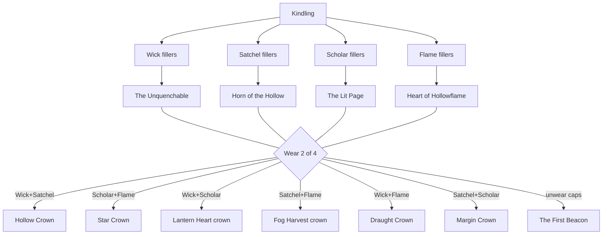
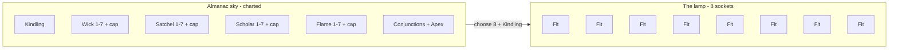
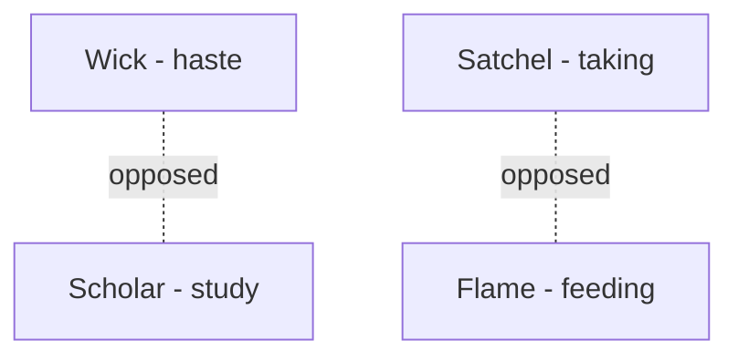
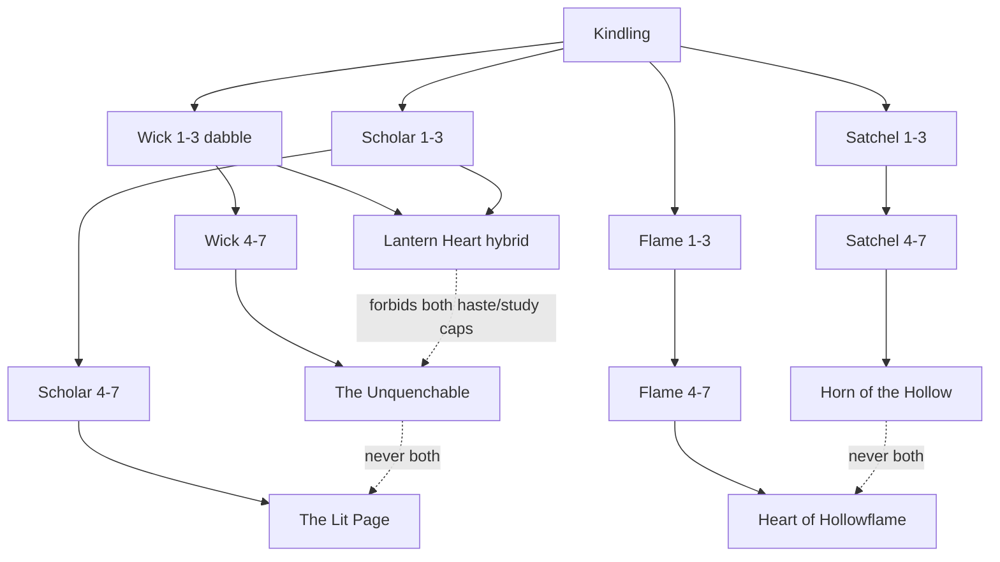
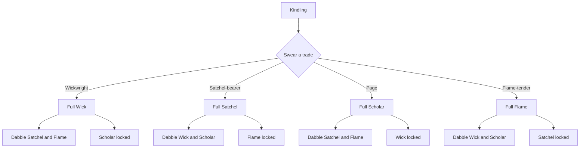

# Star tradeoffs — Radiance constellation (Wave 1 design)

**Status:** design only. No gameplay. Conductor picks; Luke sees it before any code.
**Audience:** Conductor (Game Orchestrator) and Luke.
**Non-goals:** do not implement; do not edit `src/game`, tests, CSS, or save schema; do not start Phase A, Hunt loot, Almanac search, or any other lane. Do not “fix” the wound by raising Apex’s cost or slowing `RADIANCE_PER_XP` — those are delays, not tradeoffs.

Radiance stays a never-resets prestige (charter §4, item 9). Skills, bank, and levels are never wiped to earn or spend it. `SAVE_VERSION` stays **5** unless a system below cannot land any other way.

---

## 0. Ground truth (do not change in this PR)

The live tree is a **completion grid**. Forty perks. Origin Kindling, then four identical-depth branches, then conjunctions, then Apex that requires every capstone. Respec exists and refunds every spark. Nothing is exclusive. The only choice is purchase order.

### Current nouns (`src/game/data/perks.js`)

| Noun | Id(s) | Role now |
|---|---|---|
| **Kindling** | `kindling` | Origin. Cost 1. +5% XP. Everything hangs from it. |
| **Wick** | `wick-1`…`wick-7`, `wick-cap` | Speed. Capstone **The Unquenchable** (18). |
| **Satchel** | `yield-1`…`yield-7`, `yield-cap` | Yield. Capstone **Horn of the Hollow** (18). |
| **Scholar** | `scholar-1`…`scholar-7`, `scholar-cap` | XP. Capstone **The Lit Page** (18). |
| **Flame** | `flame-1`…`flame-7`, `flame-cap` | Lumen + Radiance (+ mastery on `flame-6`). Capstone **Heart of Hollowflame** (18). |
| **Conjunctions** | `cross-wy` Quick Hands, `cross-sf` Studied Fire, `cross-ws` Lantern Heart, `cross-yf` Fog Harvest | Mid-tree pairs at ranks 3 or 5. |
| **Dual crowns** | `cap-wy` Hollow Crown, `cap-sf` Star Crown | Require **both** parent capstones. |
| **Apex** | `apex` **The First Beacon** | Requires Hollow Crown **and** Star Crown → all four branches finished. |

Two pairings have no crown of their own: Wick+Flame, Satchel+Scholar.

Costs: origin 1; fillers 2–10; branch caps 18; mid conjunctions 8 or 12; dual crowns 22; Apex 30. Sum of current `cost` fields = **339 sparks** (balance-notes rounds this ≈335). `RESPEC_LUMEN_PER_NODE = 25`. Respec refunds **all** spent Radiance; Lumen fee only. `state.perks = { owned: [], respecs: 0 }`.

### Why “purchase order” is not a build

`RADIANCE_PER_XP = 0.025` (40 action-XP ≈ 1 spark). Tend the Flame is 14 XP / 4 s → ~0.35 sparks/cycle → **~5.25 sparks/min** of raw tending. Kindling in ~12 s. One full branch including its capstone (56 sparks) in ~11 min of Tend. The whole sky (~339 sparks) in **about an hour** of continuous Tend, a few hours of mixed idle. Offline cap is 12 h of production, not of Radiance starvation.

So the 100-hour problem is not “still filling the grid.” Under today’s rule the grid is a **first-evening sheet**. After that, stars do not ask anything. A system that only slows the sheet, or that only matters at Apex, leaves the wound in place for every session after the first.

### UI that must survive

Almanac → Stars is a **branch-list** (`renderStars` in `src/ui/screens/meta.js`): section titles Origin / Wick / Satchel / Scholar / Flame / Conjunctions, then `perk-card` articles with flavor, `+% stat`, Needs-line, and a full-width Kindle button. Cards already mark capstones with a gold chip. Touch targets follow the shell (`min-height: 44px` on buttons). Flavor is on the card, not behind hover. There is no canvas, no star map, no Three.js, and there must not be.

Camp’s “Next star” row is `cheapestAvailable` — lowest-cost legal node. Completion `perkCompletion` is `owned.length / PERKS.length`. Feats: *A Star Pinned*, *Five Lights Hung*, *A Capstone*, *Rearranged Heaven*.

### The wound (owner)

> The stars (skill tree) also lacks choice. I want it to feel like you’re actually building your character and have to make choices and tradeoffs on the skills. Right now you can just take everything no need to ever respec.

Apex is the structural enforcer of take-everything: it **pays you** for lighting all four crowns.

The four systems below keep the gothic lantern voice and the existing branch names. They change **topology and permission**, not the art pipeline.

---

## System A — Two Crowns

**You are a Lampwright who can wear two crowns, never four.**

### 1. Fantasy

The pilgrim road remembers specialists. A lantern may lift two finished trades into a crown. A third crown would snuff the first two. You are not the sun. You are two bright rooms in a dark house.

### 2. Hard rule (the tradeoff)

Cheap branch fillers and mid-conjunctions stay **collectable**. You may **kindle at most two** of the four branch capstones (The Unquenchable, Horn of the Hollow, The Lit Page, Heart of Hollowflame). Lighting a third is illegal until you extinguish one.

Dual crowns stay as the prize for a *legal pair*:

- Wick + Satchel → **Hollow Crown** (unchanged).
- Scholar + Flame → **Star Crown** (unchanged).
- Wick + Scholar → promote **Lantern Heart** (already a conjunction) into a crown when both caps are lit, or add a thin crown node that requires `wick-cap` + `scholar-cap`.
- Satchel + Flame → same for **Fog Harvest**.
- Wick + Flame and Satchel + Scholar currently have **no** dual node. Add two crowns so every 2-of-4 pair has an identity (suggested names, flavor-only here: **Draught Crown**, **Margin Crown**).

**The First Beacon does not require all four caps.** It becomes the *generalist* exception: you may light Apex only with **zero branch capstones worn**. Dual-crowns go dark with them. Apex then grants a small all-stat (today’s Apex numbers, or smaller — balance later). Specialist wears two sharp capstones (and their dual-crown). Generalist wears a dimmer sun and **no** Unquenchable / Horn / Lit Page / Heart bonuses. You cannot wear Hollow Crown and The First Beacon together. You cannot wear four caps “because Apex is on.” The 2-of-4 cap rule never relaxes; Apex replaces the crowns, it does not sit on top of them.

That is the tradeoff: **two sharp trades, or one pale beacon, never both, never four.**

### 3. Why respec, and what it costs

You respec when the *work* changes: a long Foraging / Hunt night wants Horn + Unquenchable; a 99-push wants The Lit Page + Heart of Hollowflame; a Lumen drought wants Heart + Horn; a cycle-length problem wants Unquenchable + Lit Page.

**Cost:** do not wipe the fillers. **Crown-trim:** extinguish 1–2 caps and their dual-crown for **✦25 × (caps + duals released)** plus a **Radiance tithe of half those nodes’ sticker cost, not refunded**. Fillers stay kindled; their Radiance stays spent. Full-tree respec (today’s button) remains as a panic hatch at **✦25 × every owned node**, refunding filler sparks but **not** the tithe already paid on previous trims.

First three crown-trims in a save: Lumen only, full crown-spark refund (the lantern’s three honest trims). After that, the tithe sticks. `perks.respecs` already exists for the feat *Rearranged Heaven*.

If the player never wants to respec, that is still a character-build: they *picked two trades* and lived them. The First Beacon is the one late fork that asks them to give the crowns away.

### 4. Noun mapping

Keep every filler name and flavor. Keep the four capstone names. Hollow Crown and Star Crown stay. Lantern Heart and Fog Harvest graduate from “extra +%” to pair-identity. Quick Hands and Studied Fire stay as cheap mid-conjunctions (ranks 3) — they are not crowns and do not count toward the 2-of-4. Kindling stays origin. Apex stays the noun; its **requires** list changes from `(Hollow ∧ Star)` to “no branch capstone currently worn” (the player has released the two).

### 5. Feel at 10 minutes, 10 hours, 100 hours

- **10 minutes:** Kindling + first Wick or Satchel ranks. No crown yet. Choice is still “which road first,” but the card copy on each capstone should already say **“A lantern wears two crowns.”** The decision is visible before it bites.
- **10 hours:** The book of fillers is likely done or close. Two caps are lit. The other two sit Kindled-dark with “Extinguish a crown first.” This is the first time the grid *refuses*. Offline still runs the fitted bonuses; you do not babysit the tree.
- **100 hours:** New crafts and places (Chandlercraft, Vigils, later beacons) make a different pair correct. Respec is a planned evening, not a tax on XP. Completionists chase The First Beacon as a *different character*, not as the last sticker.

### 6. 360×640

Same branch-list. On each capstone card: a chip **Worn** / **Dark** / **Blocked — two crowns already**. Dual-crown cards show “Needs these two worn caps.” Apex card shows “Release both crowns to raise the Beacon.” All of that is existing card chrome (name, flavor, fx, Needs, wide button). No map.

### 7. Charter §4.9

Radiance still accrues from every skill. Spending it still fills the cheap sky. Nothing in the bank or the 99s is touched. Prestige fuel stays. The deeper optional reset named in the charter is **not** this system.

### 8. Honest comparison

**Path of Exile keystones / Timeless jewels, not Melvor 99-everything.** PoE lets you fill a lot of small nodes and then asks you to pick a few identity jewels that fight each other. Melvor’s skill “tree” is a shopping list that ends at 99 in every skill; the account is supposed to own the sheet. Two Crowns keeps the shopping list for fillers (Melvor-brain still gets a book to finish) and puts PoE-style exclusivity only on the named identities. It is **not** Melvor, because finishing the sheet does not finish the *build* — two crowns remain dark forever unless you take the pale Beacon and give the sharp ones away.

### 9. SAVE_VERSION

**Can land on v5.** No new required fields. Hydrate (same pattern as leftover-tray on v5): if `owned` contains more than two of `{wick-cap, yield-cap, scholar-cap, flame-cap}`, keep the two most recently kindled (or the two that still complete a dual-crown), strip the extras and `apex` if illegal, **refund those sticker costs into `radiance`**. `owned` IDs stay the same. Do not bump. If Draught / Margin crowns are added as new IDs, they are new rows in `PERKS`; old saves simply do not own them.

### 10. Risks

- **Fake tradeoff:** if fillers already grant most of the %. Then wearing two caps is a cherry and people still “have everything that matters.” Mitigate by keeping the **+8% capstone chunks** as the identity, and by making dual-crowns the only place the extra +5% pair lives.
- **Still take-everything:** shipping Apex as “all four, just more expensive” would restore the wound. The release-crowns rule is load-bearing. Do not also let Apex stack with Hollow Crown.
- **Too late:** first refusal is at capstone (18 sparks into a branch). Mitigate with the chip on every cap card from minute one, and with Camp “Next star” never pointing at a third cap.
- **Punitive:** stripping three caps from a live tester on hydrate without a refund would feel like a wipe. Refund the illegal sticker costs.
- **Completion %:** `owned.length / 40` can still count dark caps if we keep them in `owned` as “charted but not worn.” Prefer a later `lit` flag only if Conductor wants worn vs charted on the card; Two Crowns can encode worn as “in `owned` and among the two permitted caps.”

---

## System B — The Fitted Lamp

**You are a Lampwright who charts every star, but the brass only bears so many at once.**

### 1. Fantasy

The Almanac is a sky. The lantern is a small tin of fire. You may learn the whole choir. You may only **fit** a handful of voices into the wick at a time. Collection is memory. Fitting is character.

### 2. Hard rule (the tradeoff)

Split the tree into two layers:

- **Charted** (the book): spending Radiance **learns** a star. Permanent. This is today’s `owned`. Feats and LOG completion count charted.
- **Fitted** (the lamp): at most **8** stars may be lit on the lantern at once, **plus Kindling, which is always fitted and does not consume a socket**.

Every charted star that is not fitted is flavor + Almanac ink. It does **not** apply `effects`. `perkBonus` sums **fitted only**.

Eight is one complete trade (7 fillers + that trade’s capstone) **or** a mix (two caps + dabbles, or four mid-nodes across three branches, etc.). You cannot fit two full branches (16). You cannot fit all four caps and their dual-crowns and Apex.

Apex stays. It costs a socket like any other star, and it still requires its parents **fitted**, not merely charted. Fitting The First Beacon means those parents occupy sockets too — a generalist lamp is *possible* and **expensive in holes**, not automatic.

### 3. Why respec, and what it costs

Respec **is** the system. You re-trim when the idle target changes: fit Wick+Satchel for a fog-gather night; fit Scholar for a mastery week; fit Flame when the stall and the altar are hungry; fit a Hunt-facing mix when Vigils exist.

This is **not** a full refund of the sky. Charted stays charted. Radiance spent to learn is gone (prestige remains prestige).

**Trim cost:** ✦10 × number of stars you **unfit** in that edit, minimum ✦10. No Radiance tax. No cooldown (cooldowns punish offline). You may unfit and fit in one sheet (see UI). First trim in a save is free (lights *Rearranged Heaven*). Unlimited trims after that; Lumen is the wick-cost.

If a player never trims, they still built a character: they *chose which eight burn*. The other thirty-two are a book, not a second lamp.

### 4. Noun mapping

Do not rename branches. Kindling is the always-fitted pin. Wick / Satchel / Scholar / Flame stay lists. Conjunctions require their parents **fitted** (a Quick Hands socket is wasted if Wick-3 is charted-only). Dual crowns and Apex same. Suggested card verbs: **Chart** (spend Radiance) and **Fit** / **Unfit** (spend Lumen only when unfitting). Do not say “equip” — that word belongs to Phase A’s doll. These are stars on a lantern, not a cloak.

### 5. Feel at 10 minutes, 10 hours, 100 hours

- **10 minutes:** Kindling + 2–4 cheap charts, all of which fit automatically while sockets remain. The lamp is “whatever you just learned.” No lecture. A quiet line under the header: **Fitted 3/8**.
- **10 hours:** The book is full or nearly full. Sockets are the evening puzzle. Offline uses whatever was fitted when you closed the tin. You do not tap during the night; you trim before a long sit if you care.
- **100 hours:** The sky is a solved Almanac page. The lamp is a living build as new crafts come online. This is the 100-hour Radiance game, which today does not exist.

### 6. 360×640

Same branch-list. Header already says `N/40 stars` — change to **`Charted 40/40 · Fitted 8/8`**. Each card: existing Kindled state becomes **Charted**; add a second wide button **Fit** / **Unfit** (44px). A blocked Fit reads **Lamp is full — unfit one**. Optional: a sticky “Fitted now” strip of eight names above the branches, each a 44px chip that jumps to that card. Still typographic. No starfield.

Do not build a second doll grid. If the Fitted strip ever looks like six gear slots, it has stolen Phase A.

### 7. Charter §4.9

Learning still spends Radiance earned from all skills. Charting never wipes bank or levels. Unfitting is a Lumen trim, not a prestige reset. Prestige fuel stays.

### 8. Honest comparison

**Last Epoch blessings + Grim Dawn constellation points, not Melvor 99.** Last Epoch lets you *find* many blessings and **slot a few**. Grim Dawn lets you devote a finite point budget across a sky of stars. Melvor lets the account own every skill at 99; there is no “unequip Woodcutting.” Fitted Lamp is the idle-native version of blessings: the completionist book still fills (we already have an Almanac for that hunger) while the lamp stays a **load of eight**. It is not Melvor’s eventual-all, because the eighth socket is the last hole you will ever have.

### 9. SAVE_VERSION

**Prefer v5 hydrate, no bump.** Add `state.perks.fitted: string[]` in `hydrateState` (same family as v5 leftover-tray: new keys, no `SAVE_VERSION` bump). Migration of `owned`:

- `owned` remains the charted book.
- If `fitted` is missing, copy **Kindling + the first 8 other owned IDs in purchase order** into `fitted`.
- If a live tester already owns 20 powered stars, they **lose active bonuses** on the overflow. That is the point of the system, but it will feel like a nerf. Honest options: (a) grant one free trim-sheet on first load that starts with those 8 pre-ticked, or (b) bump to v6 so old saves keep full power until the player opens Stars once and confirms. Conductor’s call. This doc’s default is **(a) on v5**, because the campaign wants `SAVE_VERSION` 5.

Do not treat overflow as deleted from `owned` — feats *Five Lights Hung* would break.

### 10. Risks

- **Feels like a second doll / loadout screen.** Copy and layout must stay Almanac-Stars, not Camp-gear. Phase D loadouts are a later layer; do not invent two fittings “day lamp / night lamp” here.
- **Fake tradeoff:** if 8 is enough to fit all four caps + both duals + Apex, the wound returns. Count those IDs: 4 caps + 2 duals + Apex = 7, plus Kindling free, **one socket left**. That still lets a completionist wear the whole identity layer. **Mitigate:** conjunction crowns and Apex cost **2 sockets each** (still one list, a number on the card). Then Apex+two duals is 6 sockets, plus four caps is 10 — illegal. Four caps alone is 4; the player chooses caps vs conjunctions. If Conductor wants even simpler math, drop Apex as a powered node and keep it as a title feat for charting the whole sky.
- **Punitive:** unfitting during a 12 h sit because you forgot to trim is the player’s choice; do not auto-unfit. Do not charge Radiance to trim.
- **Too early locked:** auto-fit while sockets remain so the first session is still “pin a star, feel a number.”
- **Still take-everything:** charting all 40 without a socket cap is today’s game. The cap is load-bearing. Do not grow sockets with beacons, feats, or time. Eight is eight at hour 100.

---

## System C — Crossed Temperaments

**You are a Lampwright of one temperament: the wick and the page cannot both burn full.**

### 1. Fantasy

Keepers used to say the lantern has two hungers. One is **haste** (Wick) opposed to **study** (Scholar). One is **taking** (Satchel) opposed to **feeding the world’s flame** (Flame). You may dabble in a rival. You may not finish both.

### 2. Hard rule (the tradeoff)

The four branches are a cross, not a shopping list:

- Ranks **1–3** on every branch stay free (dabble). Quick Hands and Studied Fire (the rank-3 same-side conjunctions) stay legal.
- From rank **4** upward, a branch is **exclusive with its opposite**. Lighting `wick-4` makes `scholar-4`…`scholar-cap` illegal (and extinguishes them if a respec-trim needs to). Same for Satchel ↔ Flame.
- Capstones: you may wear **The Unquenchable or The Lit Page, never both**. You may wear **Horn of the Hollow or Heart of Hollowflame, never both**.
- **Lantern Heart** (`cross-ws`, Wick+Scholar) and **Fog Harvest** (`cross-yf`, Satchel+Flame) become **hybrid keystones**, not free extras: lighting one **forbids both opposed capstones**. They are the “I refuse to finish either trade” identity — a real middle, not a stack.
- Hollow Crown requires Wick-cap + Satchel-cap (same “hand” pair — legal). Star Crown requires Scholar-cap + Flame-cap (same “mind” pair — legal). Apex requires both dual crowns → **impossible** under the opposed-cap rule, unless Apex is rewritten (below).

**The First Beacon:** do not pay the player for breaking the cross. Replace Apex’s requires with a **temperament vow**: light it by naming which axis you surrender forever this age (haste-or-study, taking-or-feeding). The Beacon then grants a modest all-stat **and permanently locks the surrendered axis’s capstone**. That is a 100-hour signature, not a sticker.

### 3. Why respec, and what it costs

You respec to **flip an axis**: Wick-deep → Scholar-deep for a 99 push; Satchel-deep → Flame-deep when Radiance and Lumen matter more than stems.

**Cost:** an **axis-flip**, not a full sky wipe. Unkindle the deep ranks (4+) on one side, refund those sparks, pay **✦25 × nodes released** plus a **Radiance tithe of 8 sparks per flip** (not refunded). Dabble ranks 1–3 stay. Conjunction hybrids on that axis go dark. First two flips in a save: Lumen only, no tithe. After that, tithe sticks.

If you never flip, you still have a character: a haste-taker, a haste-feeder, a study-taker, or a study-feeder — four named temperaments, plus two hybrid cowards who took Lantern Heart or Fog Harvest instead of a cap.

### 4. Noun mapping

Keep every node id and display name. The cross is a **permission rule**, not a rename. Quick Hands / Hollow Crown = the legal “hands” pair (Wick+Satchel). Studied Fire / Star Crown = the legal “mind” pair (Scholar+Flame). Lantern Heart / Fog Harvest = the illegal pairs, reused as hybrids. Kindling unchanged. Apex rewritten as a vow, same name.

### 5. Feel at 10 minutes, 10 hours, 100 hours

- **10 minutes:** dabble ranks. You can pin Wick-1 and Scholar-1 and feel both. The cards for rank 4 already read **“Opposes The Lit Page.”**
- **10 hours:** you have finished one side of each axis, or you have taken a hybrid and felt the missing caps. Offline does not care about the dark side.
- **100 hours:** flipping an axis is a planned season (new artisan, new Vigil). The Beacon vow is a once-per-age signature.

### 6. 360×640

Branch-list with a two-line legend under the header: **Wick opposed to Scholar · Satchel opposed to Flame.** Blocked buttons use the existing `gate.error` string: **“The Lit Page is wearing this temperament.”** Hybrid cards get a chip **Hybrid — no caps on this axis.** No diagram that requires pinch-zoom; the mermaid in this doc is for Conductor, not the phone.

### 7. Charter §4.9

Flipping refunds some Radiance (the deep ranks) but does not touch skills, bank, or levels. Earning Radiance is unchanged. This is not the later deeper reset.

### 8. Honest comparison

**Grim Dawn opposing celestial paths, not Melvor.** Grim Dawn’s constellation screen lets you walk a sky and then **closes** the opposite devotion if you commit. Slay the Spire’s pathing is a cousin (you cannot take every hallway), but StS is a run; this is an account. Melvor never asks you to stop Woodcutting to have Runecrafting. Crossed Temperaments is not Melvor because **two capstones in the sky are structurally dark** for as long as you wear their rivals.

### 9. SAVE_VERSION

**v5 hydrate, no bump.** Walk `owned`. If both members of an opposed deep pair exist, keep the side with more nodes (tie: keep the more recently pushed id), strip the other side’s ranks 4+ and its cap, refund those sticker costs. If `apex` is owned under the old requires, strip it and refund 30; the vow has not been sworn. No new fields required. Optional later: `perks.vow` (`haste`|`study`|`taking`|`feeding`) when Apex ships in this shape.

### 10. Risks

- **Fake tradeoff:** if ranks 1–3 + every conjunction already equal the old sheet, depth never matters. Mitigate by keeping the **big +% on ranks 6–7 and caps** (today’s 4%, 4%, 8%).
- **Still take-everything:** leaving Apex as “own both dual crowns” would force illegal state or force a patch that lets you wear all four. Rewrite Apex or delete its bonuses.
- **Confusing on a phone:** “rank 4 exclusive” is one extra rule. If the legend is not in the header, it will feel random. Do not hide opposition behind flavor italics.
- **Punitive:** a hydrate that strips a live tester’s Scholar-cap without refund after they also bought Unquenchable. Refund.
- **Too early locked:** ranks 1–3 exist so the first session is not a class-select. Do not move exclusivity to Kindling in this system (that is System D).
- **Hybrid trap:** Lantern Heart must be *good enough* to be a build, not a noob tax. If it is weaker than either cap, nobody takes it and the “middle” is fake.

---

## System D — The Indenture

**You are a Lampwright sworn to one trade of the lantern.**

### 1. Fantasy

Hearthway still remembers indenture. After the first spark, you swear Wickwright, Satchel-bearer, Page, or Flame-tender. The other trades remain in the book as roads you did not walk. You may break indenture. Breaking it costs more the longer you served.

### 2. Hard rule (the tradeoff)

After Kindling, the next act on Stars is not a filler — it is a **vow** (four wide buttons). **Your vocation branch is fully available; its opposed branch is locked; the two neighbors dabble through rank 3.** Opposition is the same cross as System C (Wick ↔ Scholar, Satchel ↔ Flame). You do not buy the locked branch at a tax. Locked means locked until you break indenture.

| Vocation | Full | Neighbors (dabble 1–3) | Opposed (locked) |
|---|---|---|---|
| **Wickwright** | Wick | Satchel, Flame | Scholar |
| **Satchel-bearer** | Satchel | Wick, Scholar | Flame |
| **Page** | Scholar | Satchel, Flame | Wick |
| **Flame-tender** | Flame | Wick, Scholar | Satchel |

Conjunctions whose parent is locked are locked. You finish **one** capstone (your vocation) plus neighbor dabbles. **Hollow Crown and Star Crown stay dark** — they need two caps, and indenture only lights one. Apex is **not** all four trades. It becomes **the vocation’s First Beacon** — four flavor lines, one powered node, sticker cost 30, requires *your* capstone (not the old dual-crown pair):

- Wickwright → The First Beacon, Unquenchable
- Satchel-bearer → The First Beacon, Horned
- Page → The First Beacon, Lit
- Flame-tender → The First Beacon, Hearted

Same `apex` id. One Beacon per indenture; it goes dark if you break the vow, and lights again only after the new trade’s capstone.

### 3. Why respec, and what it costs

You respec to **break indenture** and swear again: the Page who wants Unquenchable for a factory phase; the Wickwright who needs Heart of Hollowflame when Radiance is the bottleneck.

**Early (charted stars ≤ 8, including Kindling):** ✦50, full Radiance refund of the vocation branch, dabble stays or refunds too (player choice on a two-button sheet: “Keep the dabbles” / “Clear the lamp”). First **three** breaks: this cheap rate. `respecs` counts them.

**Late:** ✦25 × all vocation+dabble nodes **plus an unrefunded tithe of 40 sparks** (prestige remembers you quit; flat, not a percent of `radianceEarned`). Skills/bank/levels untouched. The old vocation capstone goes dark. You may swear a new trade immediately; there is no sitting in the dark. Offline is never paused as punishment.

If you never break indenture, that is the loudest character-build of the four systems: you **are** a Page, for a hundred hours.

### 4. Noun mapping

Kindling stays the first pin, then a **vow** rather than a new origin perk id if we can help it (`perks.vocation: 'wick'|'yield'|'scholar'|'flame'`). Branch names unchanged. Locked cards stay visible (charter: no hover-gated info — show the name, the flavor, and **Locked — you swore Wickwright**). Conjunctions and dual crowns follow permission. Apex stays one id, four flavor strings.

Do not hide the locked branch. A Melvor player who cannot *see* Runecrafting thinks the game is small. A Lampwright who can read The Lit Page and cannot swear it yet feels a tradeoff.

### 5. Feel at 10 minutes, 10 hours, 100 hours

- **10 minutes:** Kindling, then four buttons. This is the first real identity tap. Cheap breaks exist so a wrong vow is a Lumen mistake, not a ruined save.
- **10 hours:** One capstone, two dabbles, a dark opposed list you still read. Offline is “my trade running.”
- **100 hours:** Either a legendary stubborn indenture (title, Beacon of that trade) or one expensive break when a new settlement asks for a different craft. Not a weekly chore.

### 6. 360×640

After Kindling, Stars opens on **four `btn-wide` vocation cards** (name, one-line fantasy, “Swear”). After the vow, the usual branch-list; locked branches render as cards with disabled 44px buttons and the lock reason in the Needs line. Header: **Indenture: Page · 3 breaks remain at the cheap rate.** No canvas.

### 7. Charter §4.9

Breaking indenture is a Radiance tithe and a Lumen fee, not a skill wipe. The opposed branch is permission, not deleted content. Prestige fuel stays. Do not gate *skills* behind vocation — Foraging is still Foraging if you swore Page; you only lack Satchel stars.

This must not become a gated tutorial. All eight crafts remain available from the start (charter §3). Vocation is stars, not a locked skill list.

### 8. Honest comparison

**PoE ascendancy / a single Grim Dawn devotion constellation, not Melvor.** Ascendancy is “you are this kind of witch, and the other three witch-ascendancies are not yours until you reroll.” Melvor is “you will 99 everything; order is convenience.” Indenture is not Melvor because **one quarter of the sky is sworn-dark** unless you pay the break (Lumen + 40 sparks, after the three cheap trims). It is closer to a class than the other three systems — which is its strength and its danger.

### 9. SAVE_VERSION

**Can land on v5 with a new hydrate key** `perks.vocation: null | 'wick' | 'yield' | 'scholar' | 'flame'`. Infer vocation from the deepest owned branch if `owned` already has post-Kindling stars; if two branches are both deep (a live take-everything save), pick the deeper, **strip the opposed branch**, refund those sparks, and toast once: “The lantern kept your strongest trade.” Do not bump. If inference feels too magical, bumping to v6 for an explicit chooser-on-load is cleaner — but the campaign wants v5, so default to infer-and-refund.

### 10. Risks

- **Too early locked:** vow at minute two, before the player knows Wick from Scholar. Mitigate with three cheap breaks and with dabble ranks so the first evening is not a monoculture.
- **Punitive:** a **percent** of `radianceEarned` as the late tithe would punish the 100-hour player hardest and recreate today’s “never touch respec,” just inverted. That is why the late cost is a **flat 40 sparks + Lumen**, not a lifetime tax. Do not add a “cold lantern” timer; idle players treat cooldowns as a slap.
- **Feels like a gated tutorial / class screen.** Copy must say you can still Gather and Hunt. Stars are the indenture, not the crafts.
- **Still take-everything:** if dabbles extend to rank 7 “at 2× cost,” that is a delay, not a lock. Do not tax-buy the opposed branch. Locked means locked.
- **Fake tradeoff:** if one vocation is strictly best (Flame’s Radiance feeding more stars), everyone swears Flame-tender. Keep vocation bonuses as they are today (each branch already has a different stat) and do not add hidden Flame synergy on the vow itself.
- **Apex four-flavor** can collapse to a rename. The Beacon must require the vocation capstone and must **not** be wearable after a break until the new cap is lit — otherwise it is a sticker you carry between identities.

---

## Conductor notes

If this bot had to pick **one** system for Wave 1, it would pick **System B — The Fitted Lamp**, with **System A — Two Crowns** as runner-up.

**Why Fitted Lamp.** The live income rate makes the sky a first-evening sheet. Any rule that only bites at Apex, or that only changes purchase order, is gone by hour two. Sockets remain after the book is full; they turn Radiance from a shopping list into a lamp you re-trim when the *work* changes (gather night, 99 push, Lumen drought, later Vigils). That is the idle-native reason to touch respec. Chart vs Fit also respects the Almanac we already shipped: completionists still fill a book; the book is not the build. UI stays a branch-list plus a Fitted 8/8 header. Charter §4.9 is untouched. Save can stay v5 if `fitted` hydrates like other v5 keys.

**Caveat on B:** eight unweighted sockets still let someone fit four caps + both dual-crowns + Apex (7) with Kindling free. If Luke picks B, **weight dual-crowns and Apex at 2 sockets** (or retire Apex as a powered node and keep it as a “charted the sky” title). Do not grow the socket count with beacons. Do not call Fit “equip.”

**Why Two Crowns is the runner-up.** Smallest topology change. Identity already lives in the capstone names. Fillers stay a completion sheet (Melvor-brain is fed) while 2-of-4 is a standing refusal. Apex-as-generalist (release the crowns) is a real 100-hour fork. Save stay on v5 with a refunding hydrate. Choose A if Luke does not want a second layer of buttons on every card, or if “another socket screen” would muddy Phase A’s doll.

**Why not C as the pick.** The cross is elegant and the existing conjunctions already encode it, but the phone has to teach “dabble 1–3, exclusive from 4, hybrids forbid caps, Apex is a vow.” That is two lectures. Hybrids will either be traps or secret-best. C is the right pick only if Luke wants *temperament* fantasy more than *lamp* fantasy.

**Why not D as the pick.** Loudest character-build, and the one that most risks “you rolled the wrong Lampwright before you understood the game,” which fights charter “no gated tutorial” and “all eight crafts deepen rather than gate.” Three cheap early breaks patch the first evening; after that the opposed quarter of the sky stays dark unless you pay Lumen + 40 sparks. That is a real class. It is the right pick only if Luke wants a class more than a lamp you re-trim. Do not replace the flat tithe with a percent of `radianceEarned`.

**Do not stack these.** Sockets plus exclusive crowns plus a vocation chooser is three UIs and a save blob the size of a doll. Ship one standing constraint. Leave Melvor’s 99-everything in Melvor.

**Phase A is still parked.** None of these systems spend Flame/Souls, open Chandlercraft, or put six gear slots on minute one. Fitted stars are not chimney slots.

Conductor shows Luke this file, records the pick, and only then briefs a builder. This agent stops at the PR.
