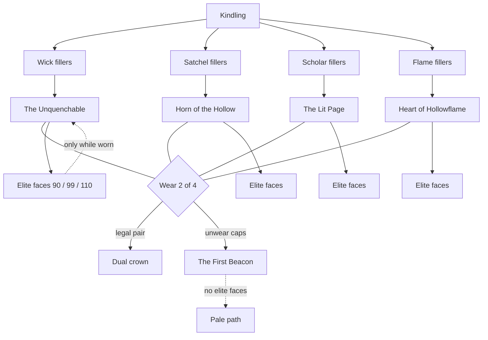

# Star tradeoffs — Two Crowns (locked pick)

**Status:** design only. No gameplay in this PR. **Locked pick: System A — Two Crowns**, with a thousand-hour elite layer.
**Audience:** Conductor (Game Orchestrator) and Luke.
**Non-goals:** do not implement; do not edit `src/game`, tests, CSS, or save schema; do not start Phase A, Hunt loot, Almanac search, or any other lane. Do not “fix” the wound by raising Apex’s cost or slowing `RADIANCE_PER_XP`.

Radiance stays a never-resets prestige (charter §4, item 9). Skills, bank, and levels are never wiped to earn or spend it. `SAVE_VERSION` stays **5**.

---

## Owner (Luke), 28 Aug 2026 ~00:20 UK

> If you think the two crowns system is best lets go for that but does it fit into our goal of a game thats playable for thousands of hours. We need the player to feel progression but needs to have late game end goals thats hard to reach maybe ‘elite Capstones’ that unlock once certains skills hit certain levels, send in the design again to make sure its up to standard. Let me know your thoughts when its done.

**Conductor:** Two Crowns is the identity layer. Today’s sky is a first-evening sheet (~339 sparks, ~1 hour of Tend). Two Crowns that only refuse a third *early* capstone is a character-build for week one, then the tree is quiet for 999 hours. That fails the thousand-hour test. This file is the spec that hangs **elite faces** on the XP curve we already shipped (`MAX_LEVEL` 120, milestone 99, soft caps at 30/60/90, elite tax past 99).

---

## 0. Ground truth (unchanged live tree)

The live constellation is a **completion grid**. Forty perks. Origin Kindling, four identical-depth branches, conjunctions, Apex that requires every capstone. Respec exists (`RESPEC_LUMEN_PER_NODE = 25`) and refunds every spark. Nothing is exclusive. The only choice is purchase order.

| Noun | Id(s) | Role now |
|---|---|---|
| **Kindling** | `kindling` | Origin. Cost 1. +5% XP. |
| **Wick** | `wick-1`…`wick-7`, `wick-cap` | Speed. Capstone **The Unquenchable** (18). |
| **Satchel** | `yield-1`…`yield-7`, `yield-cap` | Yield. Capstone **Horn of the Hollow** (18). |
| **Scholar** | `scholar-1`…`scholar-7`, `scholar-cap` | XP. Capstone **The Lit Page** (18). |
| **Flame** | `flame-1`…`flame-7`, `flame-cap` | Lumen + Radiance. Capstone **Heart of Hollowflame** (18). |
| **Conjunctions** | Quick Hands, Studied Fire, Lantern Heart, Fog Harvest | Mid-tree pairs. |
| **Dual crowns** | Hollow Crown, Star Crown | Need **both** parent caps. |
| **Apex** | `apex` **The First Beacon** | Needs both dual crowns → all four branches. |

Sum of current `cost` fields = **339 sparks**. `RADIANCE_PER_XP = 0.025`. Tend the Flame ≈ **5.25 sparks/min** raw → Kindling in ~12 s, one full branch including cap (~56 sparks) in ~11 min, the whole sky in **about an hour** of Tend. After that, stars do not ask anything.

XP curve (`src/core/xp.js`, balance-notes): total XP 1→90 ≈ **3.45M**, 1→99 ≈ **5.78M**, 1→110 ≈ **10.2M**, 1→120 ≈ **17.5M**. Raw Tend (~12.6k XP/h) is ~270 h to 90, ~460 h to 99, ~810 h to 110, ~1,390 h to 120 — **in that one skill**. Charter pacing: minutes to feel progress, hours to master a skill, **weeks toward 99**. Offline cap stays 12 h; elites must not raise it.

UI that must survive: Almanac → Stars is a **branch-list** of `perk-card`s, flavor on the card, full-width Kindle, capstone gold chip, touch ≥44px, no hover-gated map, no canvas.

The wound (owner, earlier): *“I want it to feel like you’re actually building your character… Right now you can just take everything no need to ever respec.”* Apex currently **pays you** for lighting all four crowns.

---

## Spec — Two Crowns (identity layer)

**You are a Lampwright who can wear two crowns, never four.**

### Standing rule (load-bearing)

Cheap branch fillers and mid-conjunctions stay **collectable**. You may **kindle at most two** of the four named branch capstones:

- **The Unquenchable** (Wick)
- **Horn of the Hollow** (Satchel)
- **The Lit Page** (Scholar)
- **Heart of Hollowflame** (Flame)

Lighting a third is illegal until you extinguish one.

Dual crowns are the prize for a *legal pair*. Add the two missing pair identities so every 2-of-4 has a name:

| Worn pair | Dual crown |
|---|---|
| Wick + Satchel | **Hollow Crown** (exists) |
| Scholar + Flame | **Star Crown** (exists) |
| Wick + Scholar | **Lantern Heart** (promote from conjunction, or a thin crown node on both caps) |
| Satchel + Flame | **Fog Harvest** (same) |
| Wick + Flame | **Draught Crown** (new) |
| Satchel + Scholar | **Margin Crown** (new) |

Quick Hands and Studied Fire stay cheap rank-3 conjunctions. They are **not** crowns and do not count toward 2-of-4.

**The First Beacon does not require all four caps.** It is the *pale generalist*: you may light Apex only with **zero branch capstones worn**. Dual-crowns go dark with them. Apex grants a small all-stat. Specialist wears two sharp caps (and their dual-crown). Generalist wears a dimmer sun and **no** Unquenchable / Horn / Lit Page / Heart bonuses. You cannot wear Hollow Crown and The First Beacon together. You cannot wear four caps “because Apex is on.” Apex **replaces** the crowns; it does not sit on top of them.

**Two sharp trades, or one pale beacon, never both, never four.**

### Why respec, and what it costs

You respec when the *work* changes: a gather / Hunt night wants Horn + Unquenchable; a 99-push wants The Lit Page + Heart; a Lumen drought wants Heart + Horn.

**Crown-trim:** extinguish 1–2 caps and their dual-crown for **✦25 × (caps + duals released)** plus a **Radiance tithe of half those nodes’ sticker cost, not refunded**. Fillers stay kindled. First **three** trims in a save: Lumen only, full crown-spark refund. After that, the tithe sticks. Full-tree respec remains a panic hatch at ✦25 × every owned node (refunds filler sparks, not prior tithes).

Elite faces (below) **stay in the book** when you unwear a crown; they **stop applying** until that crown is worn again. Levels are never wiped. That is why hour-400 respec is real: you may have been a Wickwright who quietly 99’d Foraging, then trim onto Horn and kindle its Vowed face the same evening — Radiance pays the sticker, **Foraging 99 was the gate you already walked**.

### SAVE_VERSION (identity layer)

**v5 hydrate, no bump.** If `owned` contains more than two of `{wick-cap, yield-cap, scholar-cap, flame-cap}`, keep the two most recently kindled (prefer a pair that still completes a dual-crown), strip extras and illegal `apex`, **refund those sticker costs into `radiance`**. New dual-crown IDs are new `PERKS` rows; old saves simply do not own them.

---

## Two Crowns at a thousand hours

Two Crowns without a late layer fails Luke’s test. The fillers and the early caps are a **first-evening sheet**. The thousand-hour game is the **same two crowns, with faces the early lamp cannot wear**.

### 1. Standing rule stays

Wear 2 of 4 *named* branch caps. Fillers stay collectable. Apex is the pale generalist who wears **zero** branch caps, never four. Do not restore take-everything. Do not add a third crown “because 99.” Do not let Radiance buy an elite that Combat 20 could afford.

### 2. Elite capstones — level is the gate, Radiance is the sticker

Elites are a **second, rare layer of cards** under each named crown. They are **illegal to kindle until a skill (or pair of skills) hits a hard level**. Radiance still pays the sticker. **Level is the gate.** Spark-rich, level-poor saves see the card and cannot press Kindle.

Bands use the curve we already shipped, not a shop of +1% forever:

| Face | Level gate | Hours band (one skill, raw Tend-equivalent) | Calendar (charter) |
|---|---|---|---|
| **Kindled** (today’s cap) | none (Radiance only) | minutes–an evening | first session |
| **Settled** | **90** | ~270 h raw in that skill | weeks; last climb before 99 |
| **Vowed** | **99** (milestone) | ~460 h raw | weeks-to-months |
| **Last Wick** | **110** | ~810 h raw | months more; post-99 elite tax |
| *(120 exists as MAX_LEVEL; it is not a fifth elite shop. 120 is mastery brag, titles, maybe Phase E laws — not another +% star.)* | | ~1,390 h raw | thousand-hour cap per skill |

Cards are **visible before reachable**. Copy: **Locked — Emberkeeping 90**, never a mystery `?`. Locked is not “coming soon” toast; it is a named door with a number the HUD already shows.

### 3. Elites still obey Two Crowns — pick: deeper face of a worn crown

**Locked option: an elite is a deeper face of a crown you already wear.** You wear The Unquenchable; Emberkeeping 99 lets you kindle **The Vowed Wick**. The 2-of-4 rule still holds. You do not grow a fifth hole.

The player should feel: *I am still a Wick+Satchel Lampwright at hour 800, but the Unquenchable I earned at hour 2 is not the Unquenchable I wear at hour 800.*

**Rejected: a third socket that only exists at 99.** That is Fitted Lamp in disguise and it weakens Two Crowns. At hour 800 everyone wears two early caps plus a “99 hole” stuffed with the best leftover elite — take-everything with extra steps.

**Allowed, still 2-of-4: dual-crown vowed faces.** Hollow Crown at Emberkeeping 99 **and** Foraging 99 kindles **The Road Hurries, Vowed**. Harder. Still only two branch caps. Not a third crown.

**How faces apply.** You may **Kindle** an elite only while its parent cap is among the two worn crowns. Elite IDs may then sit in `owned` (the book). `perkBonus` applies an elite **only while that parent is still worn**. Unwear Unquenchable → Settled/Vowed/Last Wick go dark. Charted, not powered. Respec does not delete the 99 you walked. Touring all four crowns to bank faces is possible and **expensive** (trim tithe after the three free trims); it still never powers more than two crowns at once.

**Apex** wears **no elite faces**. The pale path may later get its own generalist faces (see gate table) that never restore branch-cap bonuses.

### 4. Progression without power creep

Do not raise live speed / yield / XP into +400%. Yield already hard-caps at **55%**. Elites should change **identity verbs** — named laws in the same family as leftover-eat, recap-honesty, auto-restart, “one action until a second-wick lantern perk” — more than raw %.

If an elite is +%, it is a **Last Wick (110) last-band** of **+1–2%** on that crown’s stat, not a second camp track. Settled (90) and Vowed (99) are verbs. They may grant **+0**.

**Do not** steal Phase A’s chimney / second-wick / doll. If Phase A ships “a second action when the first chimney is smithed,” that is a **lantern law on a clock of hours**, not Emberkeeping 90 (a clock of hundreds of hours). Wick elites must be *other* verbs.

Suggested verbs (flavor + implementable law; numbers are doors, not this PR’s code):

| Crown | Face | Identity verb (not a +% shop) |
|---|---|---|
| Unquenchable | Settled (90) | **The wick names the halt.** Action card previews dry-halt 3 cycles out (tinder/fuel remaining as a named line). You are not surprised. |
| Unquenchable | Vowed (99) | **Choir that holds.** One pinned Wick-side action resumes after halt, death, and recap Claim without a re-tap (stronger auto-restart; still spends fuel honestly). |
| Unquenchable | Last Wick (110) | **Outlives the keeper.** +2% speed last-band. First cycle after Claim starts full. **Do not raise the 12 h offline cap.** |
| Horn | Settled (90) | **Second glance (law).** Failed bonus-find rerolls once; still under the 55% yield cap. |
| Horn | Vowed (99) | **The land leans.** Gathering cycles on kindled stretches may roll one named extra (tinder, resin) that is **not** yield%. Separate small table. |
| Horn | Last Wick (110) | **Horn of Twelve.** +2% yield last-band toward the same 55% cap. Phase B door: kindling a settlement yields a one-time Horn cache. |
| Lit Page | Settled (90) | **The page keeps the next want.** Camp “Next star” / next feat / next mastery hook stay honest when you rotate crafts (no stale cheapest-node). |
| Lit Page | Vowed (99) | **Open Codex (law).** Mastery hooks on *worn-crown skills* also write a short Almanac journal line (skip-able). Study is visible. |
| Lit Page | Last Wick (110) | **Ink that does not cool.** +2% XP last-band. |
| Heart | Settled (90) | **Kindred spark (law).** Daily embers: +1 spark on claim while Heart is worn. Retention, not combat power. |
| Heart | Vowed (99) | **Beacon dues (law).** Wave 2 door: Flame/altar spend (Phase A parked) is cheaper while Heart is worn. Wave 1: Radiance frac survives recap freeze without leaking ticks — honesty, not a mint. |
| Heart | Last Wick (110) | **Heart that remembers the sun.** +1% lumen and +1% radiance last-band. |
| Hollow Crown | Vowed pair (Ek 99 ∧ Fo 99) | **The Road Hurries, Vowed.** Hunt leftover tray keeps one extra named stem while this dual is worn. Hunt furniture, not a fifth crown. |
| Star Crown | Vowed pair (two 99s on Scholar’s gate ∧ Emberkeeping 99) | **Star Crown, Vowed.** Almanac LOG mean does not change on visit (already S4e); additionally, next-feat hint names a Radiance door. Pale prestige, not +% combat. |
| Apex (pale) | Settled generalist | **Four crafts at 60.** Small all-stat already on Apex; this face only **names** them on the card. No branch caps. |
| Apex (pale) | Vowed generalist | **Four skills at 99.** Title + lantern frame. Still zero branch caps. The completionist sun, dimmer than two Vowed specialists. |

These verbs are **spec targets**. Wave 1 may ship the cards as Locked without the verbs wired. Do not invent a 72-perk sheet (CUT).

### 5. Feel at 10 min / 10 h / 100 h / 1000 h / 3000 h

| Band | What you wear | Camp **Next star** | Still dark | Why respec? |
|---|---|---|---|---|
| **10 min** | Kindling + first Wick or Satchel fillers. No crown yet. | Cheapest legal filler (`cheapestAvailable`). Cap cards already read **A lantern wears two crowns.** | All caps, all elites (**Locked — Emberkeeping 90** visible). | You don’t. Three free trims exist later. |
| **10 h** | Fillers done or close. **Two early caps** worn. Dual-crown if the pair matches. | Dual-crown sticker, or “Blocked — two crowns already” pointing at a **filler on a dark branch** (still collectable), never a third cap. Elite line: **Next crown face: Settled Wick — Locked, Emberkeeping 90.** | Two named caps (refused). All elite faces. Apex unless you released the two. | Hour 8: you picked the wrong pair for the work (Hunt night vs Tend). Cheap trim. |
| **100 h** | Same two early caps. Skills likely in the 30–60 band (1→60 ≈ 0.69M XP ≈ tens of hours, not 90). | Still the Settled face, still Locked on 90. The tree is **quiet on purpose**; progression is the skill bar, not a new +%. | Elites. The other two crowns. | Only if a **new live craft** (Phase A Chandlercraft, a Vigil) makes another pair the work. Not a weekly chore. |
| **1000 h** | Same identity (e.g. Wick+Satchel) with **Settled and maybe Vowed** faces kindled on those two. Someone who split XP across eight crafts may only just be touching 90s. | **Kindle The Vowed Wick** (if 99), or **Locked — Foraging 99** on Horn, or the dual-crown vowed face. | The other pair’s faces (you don’t wear them). Last Wick 110. Apex-if-specialist. | **Hour 400–800:** you 99’d a skill whose crown you do *not* wear. Trim onto that crown; elite faces kindle in an evening of sparks because **the level was the real cost.** Tithe is the prestige tax for changing identity. |
| **3000 h** | One or two **Last Wicks**. Maybe a 120 as brag. A stubborn Lampwright still Wick+Satchel; a trimmer has worn three pairs *across seasons* but never four at once. | Last Wick on a worn crown, or a dual-crown vowed, or pale Apex as a *different character*. | Whatever pair you are not. That darkness is the build. | Seasonal: factory phase wants Heart; road phase wants Horn; 120-push wants Lit Page. Never “collect the last elite for the sheet.” |

Offline: bonuses are whatever was worn when you closed the tin. You do not babysit elites during a 12 h sit. Trim **before** a long sit if the work changed.

### 6. New skills add faces and gates, not 40 cheap fillers

CUT already forbids **72 Radiance perks**. Cheap fillers stay **Wave-1 sized** (the current 7+cap per branch). Later crafts **do not** clone Wick-1…Wick-7.

Each new craft adds a **gate alternative** and/or a **named face** on an existing crown:

| Wave / phase | What exists | What stars do |
|---|---|---|
| **Wave 1** (now) | Emberkeeping, Foraging, Combat playable. Two Crowns rule. | Early caps + duals + Apex rewrite. Elite **cards** for live gates, mostly Locked. |
| **Phase A = Wave 2** | Chandlercraft, first Smithing hammer, spend Flame/Souls, doll after first chimney. | **Name** Chandlercraft elites as doors. Do not spend Flame/Souls in this spec. **The Spool:** Chandlercraft 90 may Settle Unquenchable *instead of* Emberkeeping 90 (either/or). Heart Vowed altar-law waits for spend-Flame. |
| **B — road** | Settlements, travel. | Horn Last Wick cache on kindle. Hollow Crown vowed as road identity. No new filler branch. |
| **C — factory / oil tiers** | Oil, wick goods. | Chandlercraft 99 / 110 faces on Wick or Heart. Still 2-of-4. |
| **D — loadouts / sets** | Gear sets. | Do **not** turn crowns into doll sockets. Loadouts are chimney and cloak, not stars. |
| **E — late laws** | Named account laws. | Last Wick verbs and 120 brag titles live here if not already shipped. |
| **F — 400–500 items** | Lattice fill. | No star sheet. Items are uses, not perks. |

**Scholar’s Wave-1 proxy gate** (Almanac skill is not playable yet): Settled Page = **two live skills at 90**; Vowed Codex = **two live skills at 99**; Last Wick = **two live skills at 110**. When Almanac the craft ships, those gates **become Almanac 90 / 99 / 110** (plus one other 99 for the vowed dual). Do not leave both proxies and Almanac stacked forever — one sentence in data when that skill goes live.

**Mining / Fishing:** Satchel gate alternatives (Foraging 90 **or** Mining 90 to Settle Horn). The land includes shafts and meres. Not a new Satchel filler list.

**Smithing:** Draught / Heart face door (hardware feeding the flame). Wave 2+.

### 7. 360×640 UI

Same branch-list. Under each named capstone, three elite cards (Settled / Vowed / Last Wick), full-width buttons ≥44px.

Chips: **Worn** / **Dark** / **Blocked — two crowns already** on the four caps. Elite chips: **Locked — Emberkeeping 90** / **Kindle · N Radiance** / **Worn face**. Dual-crown elite: **Locked — Emberkeeping 99 and Foraging 99**.

Header: `Radiance unspent · 2 of 4 crowns · faces 1/6` (two worn crowns × three faces). Flavor on the card, Needs-line names the skill **and** the current level (`Emberkeeping 62 / 90`). No hover, no canvas, no starfield, no kit.

Camp “Next star” may point at a Locked elite (breadcrumb). It must never point at a third early cap.

**Honest completion:** LOG mean stays Skills / Mastery / Items / Feats. Do not pad it with unkindleable Chandlercraft elites (empty-99 honesty). Stars may show the cards; `perkCompletion` should count **kindleable** rows only (live gates). Feats: *A Capstone* stays; add *A Crown Settled* (first 90 face), not *Own every elite*.

### 8. SAVE_VERSION 5, charter §4.9

No bump. Elite rows are new perk IDs (`wick-cap-90`, `wick-cap-99`, `wick-cap-110`, …) or a `perks.faces` map. Prefer **IDs so they render as cards**. Hydrate:

- Unknown IDs ignored (forward-safe).
- `perks.owned` may contain elite IDs before the parent cap is worn; effects stay off until wear-check.
- If a live tester already owns four early caps, identity-layer hydrate still strips to two and refunds (see above). Elites they could not have kindled yet (no 90s in Wave 1 testers) simply appear Locked.
- Do not wipe skills, bank, or levels. Radiance refund is only for **illegal early caps / Apex**, never for XP.

### 9. Honest comparison

**OSRS 99s:** a 99 is a cape and a skill done; the account is expected to 99 *many* skills. The cape does not ask you to take off another cape. Two Crowns + elites: you may 99 all eight crafts; you still wear **two** crown-faces. The 99 **opens a door on a worn trade**, it is not a pet.

**Melvor 99 + pets:** Melvor’s long game is 99 everything, then pets, then 99 mastery, then completion. The sheet is supposed to fill. **Elite ≠ a pet you get for 99 everything.** A Melvor pet is an account sticker that stacks with every other pet. Our Vowed Wick **replaces** the Kindled Unquenchable’s *meaning* while you wear it; the Lit Page’s Vowed face stays dark if you do not wear Scholar. Finishing every 99 does not finish the *lamp*.

**PoE ascendancy + Uber Lab:** you pick an ascendancy (Two Crowns ≈ a pair of notables) and Uber Lab gives **deeper points in that ascendancy**, not a second class. Elite faces are Uber Lab. You do not Lab into four classes at once.

**Last Epoch weaver tree:** a huge sky you specialize by occupying regions. We refuse that UI on a phone. We take only the idea that **late points deepen a region you already chose**.

### 10. Stress test / fail conditions

This design **fails** if any of these ship:

1. **Radiance at Combat 20 kindles an elite.** Level gate was skipped or replaced with a spark tax. *Fix:* Kindle disabled until `levelFromXp` meets the band; sparks do not substitute.
2. **Elites invisible until 99** (mystery gates, empty `?`, hover-only desktop). *Fix:* cards exist from Wave 1 with **Locked — Emberkeeping 90** and current level.
3. **Elites are just more +%.** A second camp track. *Fix:* 90/99 are verbs; 110 is +1–2% last-band only; yield never breaks 55%.
4. **Third socket at 99** or Apex that stacks with two caps. Take-everything returns.
5. **Elite effects apply while the parent cap is not worn.** Then a trimmer banks all twelve faces and swaps for Lumen — the book *is* the build again. Wear-check is load-bearing.
6. **72 cheap fillers** when Mining ships. *Fix:* gates and faces only.
7. **Offline cap raised** as a Wick elite. Honesty dies.
8. **Chandlercraft elite verbs coded in Wave 1.** Phase A is parked; cards may exist as Locked — Chandlercraft 90.
9. **LOG 0=0 / empty 99s** because unkindleable elites entered the mean. Stars ≠ LOG denominator.
10. **No reason to respec after hour 20** because only one pair is viable and elites don’t change the work. *Fix:* pair identities stay different verbs (halt-naming vs second-glance vs study vs dues); new crafts add gates that make another pair the right lamp for a season.

---

## Thoughts (for Luke)

Two Crowns is the right identity: a lantern of two rooms, not a sun. Alone, it is done by bedtime. The XP curve we already shipped is the thousand-hour machine — 90 / 99 / 110 are **weeks, months, and the post-99 tax**, not an evening of sparks. Hanging elite *faces* on those bands means the Wickwright at hour 800 is still a Wickwright, and the star is not the same star. A player who 99s everything still cannot wear four Last Wicks. That is the difference from Melvor’s pets and from “eventually you have it all.”

The pale Beacon stays for the Lampwright who wants a dimmer, wider sun. That is a character, not the last sticker.

---

## Conductor brief

Locked rule, eight bullets:

1. Wear **2 of 4** named caps (Unquenchable / Horn / Lit Page / Heart). Fillers collectable. Dual-crown for the legal pair (add Draught, Margin; promote Lantern Heart, Fog Harvest).
2. **Apex = pale generalist, zero branch caps**, never four, never stacked with a dual-crown.
3. Elites are **deeper faces** of a **worn** crown (90 Settled / 99 Vowed / 110 Last Wick). Not a fifth crown, not a 99 socket.
4. **Level is the gate; Radiance is the sticker.** Visible Locked cards. No spark substitute.
5. **90/99 = identity verbs; 110 = +1–2% last-band** (yield still 55%). No +400%. No 12 h cap raise.
6. Elite effects **only while parent cap is worn**. Book keeps faces across trims; levels never wipe (charter §4.9).
7. New crafts add **gates/faces**, not 40 fillers. No 72-perk sheet.
8. **SAVE_VERSION 5.** Hydrate illegal extra caps with Radiance refund. Elite IDs hydrate as Locked.

### Elite gate table

| Elite noun | Parent crown | Gate | Hours band | Wave |
|---|---|---|---|---|
| The Settled Wick | Unquenchable | Emberkeeping **90** (later: **or** Chandlercraft 90) | weeks | W1 card / W2 Chandlercraft door |
| The Vowed Wick | Unquenchable | Emberkeeping **99** (later: or Chandlercraft 99) | weeks–months | W1 card |
| The Last Wick | Unquenchable | Emberkeeping **110** | months+ | W1 card; verb may wait |
| The Remembering Horn | Horn | Foraging **90** (later: or Mining 90 / Fishing 90) | weeks | W1 card |
| Horn, Vowed | Horn | Foraging **99** | weeks–months | W1 card |
| Horn of Twelve | Horn | Foraging **110** | months+ | W1 card; cache = Phase B |
| The Settled Page | Lit Page | **Two live skills at 90** (becomes Almanac 90 when that craft ships) | weeks | W1 proxy |
| The Vowed Codex | Lit Page | **Two live skills at 99** (becomes Almanac 99) | months | W1 proxy |
| The Page That Outlasts Ink | Lit Page | **Two live skills at 110** | months+ | W1 proxy |
| Heart Settled | Heart | Emberkeeping **90** ∧ Combat **70** | weeks | W1 card |
| Heart Vowed | Heart | Emberkeeping **99** | months | W1 card; altar-law = Phase A door |
| Heart that Remembers the Sun | Heart | Emberkeeping **110** | months+ | W1 card |
| Pale-Wise / Road Hurries, Vowed | Hollow Crown | Combat **85** ∧ Foraging **70** for Hunt furniture; **both 99s** for the vowed dual | Hunt: long Wave 1; dual 99s: months | W1 Hunt card; road = Phase B |
| Star Crown, Vowed | Star Crown | Scholar gate at 99 ∧ Emberkeeping 99 | months | later |
| The First Beacon, Pale | Apex (no caps) | Four live skills at **60**, then four at **99** | 100 h → 1000 h+ | W1 Apex rewrite; pale faces later |

Sticker costs (balance later, not this PR): Settled ~20, Vowed ~30, Last Wick ~45. Must not be the bottleneck; **level is**.

### What NOT to implement this Wave

- **Do not code Chandlercraft / Mining / Fishing / Almanac-skill / Smithing elite verbs.** You may **show** those cards as **Locked — Chandlercraft 90** (honest door) or omit them until the skill is playable. Prefer omit-from-LOG, show-on-Stars only when the skill exists.
- **Do not** spend Flame/Souls, open the doll, ship second-wick as an Emberkeeping-90 elite, raise offline cap, or add 40 fillers.
- **Wave 1 builder (when Conductor briefs one):** Two Crowns permission on the four named caps + Apex rewrite + dual-crown pair completions + **elite cards as Dark/Locked** for live gates (Emberkeeping, Foraging, Combat). Verbs may land in later S4 rounds. This PR is still **design only**.

---

## Appendix — rejected systems (one paragraph each)

**B — The Fitted Lamp** (chart every star, fit 8). Strong idle loop, and it would survive a thousand hours without elites — but it is a second doll on Almanac, fights Phase A’s chimney slots, and Luke picked crowns. Do not stack sockets on Two Crowns.

**C — Crossed Temperaments** (Wick ↔ Scholar, Satchel ↔ Flame). Elegant, but the phone must teach dabble/exclusive/hybrids/vow. Two Crowns already refuses two caps; opposition would double-lecture. Keep the cross only as flavor in pair names (hands vs mind), not as a second permission engine.

**D — The Indenture** (swear one trade at Kindling). Loudest class, worst first-evening lock, fights “all eight crafts deepen rather than gate.” Two Crowns lets you *wear* two trades without rolling a Lampwright at minute two. Cheap indenture-breaks were a patch; we did not pick a class.
